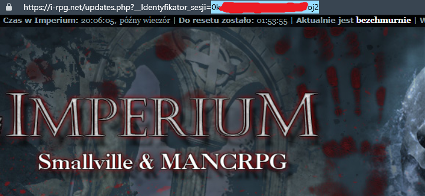
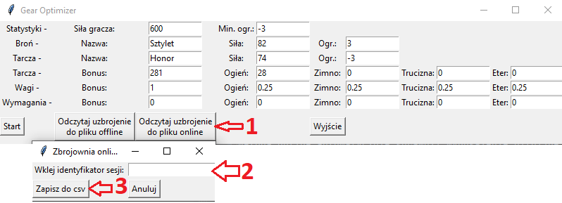
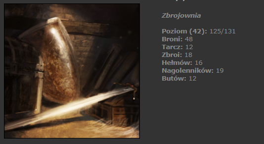
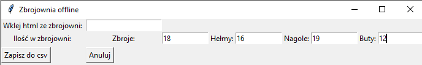
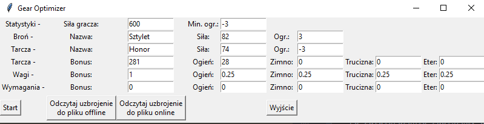
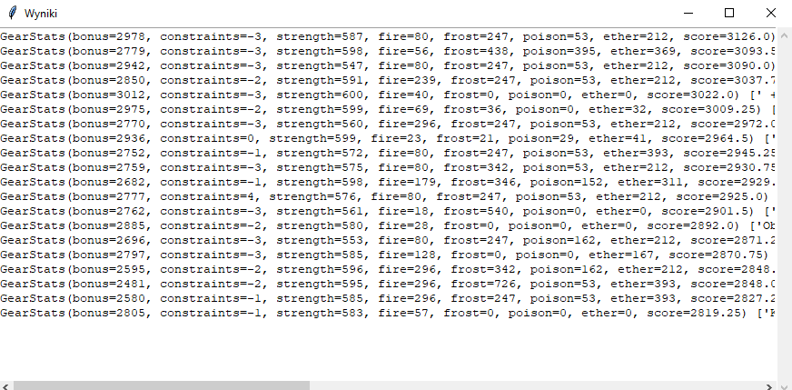

# Gear Optimizer

Gear optimizer for i-rpg.net online game written in Python

## Getting Started

These instructions will get you a copy of the project up and running on your local machine for development and testing
purposes.

### Prerequisites

All required modules are in `requirements.txt` file. Please use:

```
pip install -r requirements.txt
```

### Running tests

```
python -m unittest
```

### Running application

```
python optimizer.py
```

### Equipment csv file

`guild_eq.csv` is a file with all available equipment that a player has access to.  
An example file is attached to this repo. Please use it to keep correct csv format.

### Build

In order to build the project and distribute it as and executable you need `Pyinstaller`:

```
pip install pyinstaller
```

Then to create executable run:

```
pyinstaller optimizer.py
```

That's it! You will find en executable file and all additional files in `dist/optimizer`  
Please attach also `guild_eq.csv` file to the files.

# Instrukcja

## Pobieranie

Wersja aplikacji dla systemu Windows znajduje się w `Releases` pod nazwą `gear_optimizer.zip`. Link poniżej:

https://github.com/jacaczap/gear-optimizer/releases.

Jest to jedyne źródło oryginalnego programu. Nie należy korzystać z innych źródeł, gdyż mogą one zawierać złośliwy
kod.  
Kod aplikacji znajduje się w tym repozytorium, a sama aplikacja jest budowana automatycznie, korzystając z github
actions.  
Skrypt budujący znajduje się w katalogu `.github/workflows/build_app.yml`.

## Użytkowanie

### Uruchamianie

Paczkę `gear_optimizer.zip` rozpakowujemy. Plik startujący aplikację to `optimizer.exe`.

### Przygotowanie pliku z ekwipunkiem

Plik z ekwipunkiem ma postać pliku CSV. Można go stworzyć samemu, wzorując się na pliku załączonym do tego
repozytorium (`guild_eq.csv`). Zalecane jest jednak użycie jednego z dwóch automatycznych mechanizmów zawartych w
programie.

#### Metoda online

Metoda online automatycznie sprawdzi wyposażenie gildyjnej zbrojowni i zapisze znalezione przedmioty do pliku CSV.
Metoda ta jest legalna - nie wykonuje żadnych akcji poza odczytem danych i zostało to potwierdzone przez administratora
gry.

**Korzystając z tej, metody należy używać tylko aplikacji pobranej z oficjalnego repozytorium. Używając jej, dajemy
programowi dostęp do naszego konta!**

1. Logujemy się do gry i kopiujemy `Identyfikator_sesji` z linku, do którego zostaliśmy przekierowani, tak jak pokazano
   poniżej.
   

2. Uruchamiamy `optimizer.exe` i klikamy w `Odczytaj uzbrojenie do pliku online`. W pole wklejamy nasz identyfikator. Po
   zatwierdzeniu zapiszemy plik z uzbrojeniem do wybranego miejsca.
   

#### Metoda offline

Metoda offline jest zalecana, jeżeli nie mamy zaufania do źródła programu. Nie dajemy w niej dostępu do swojego konta,
ale wykonujemy wszystkie operacje ręcznie.

1. Uruchamiamy `optimizer.exe` i klikamy w `Odczytaj uzbrojenie do pliku offline`.

2. Logujemy się do gry i wchodzimy do zbrojowni. Wprowadzamy ilości poszczególnego uzbrojenia do programu.
   
   

3. Wchodzimy w `Zarządzaj sprzętem` i otwieramy źródło strony. Dla przeglądarki Chrome i Opera jest to skrót `CTRL + U`.
   Kopiujemy całą stronę (`CTRL + A`, `CTRL + C`) i wklejamy w pole `Wklej html ze zbrojowni`

4. Zatwierdzamy przyciskiem `Zapisz do csv`.

### Optymalizacja zestawu uzbrojenia

Gdy posiadamy już plik z uzbrojeniem, możemy przejść do głównej części optymalizatora:


1. Pierwszą czynnością, jaką musimy zrobić to uzupełnienie `siły gracza` oraz `minimalne ograniczenia` (maksymalny
   minus), na jakie jesteśmy gotowi. Wartości te można dowolnie modyfikować, aby zobaczyć czy zwiększenie siły, lub
   pogorszenie ograniczeń pozwoli nam ubrać znacząco lepsze uzbrojenie.

2. Następnie wprowadzamy dane `broni` i `tarczy`. Jeżeli używamy sprzętu poprawiającego ograniczenia, należy wpisać
   wartość bez minusa. Należy pamiętać, aby wprowadzić siłę wymaganą przez najcięższą broń, którą będziemy używali. W
   przeciwnym wypadku program dopasuje uzbrojenie do lżejszej broni.  
   Jeżeli nie używamy broni lub tarczy, wpisujemy 0, a nazwę zostawiamy pustą.

3. `Wagi` służą do obliczania „wyniku” uzbrojenia. Im wyższą wagę wprowadzimy dla wybranej statystyki, tym większy wpływ
   będzie ona miała na ostateczny wybór uzbrojenia. Zalecane jest pozostawienie wagi dla `bonus` na `1`, a dla żywiołów
   wartości w przedziale `0-1`. Jeżeli nie potrzebujemy danego żywiołu ustawiamy `0`.

4. `Wymagania` to wartości minimalne, jakie chcemy, żeby wynikowe zestawy posiadały. Jest to bardzo przydatne, w
   momencie, gdy wiemy, że potrzebujemy np. co najmniej 200 obrony przed ogniem na daną lokację. Jeżeli nie potrzebujemy
   minimalnej wartości to ustawiamy `0`.

5. Po wprowadzeniu wszystkich wartości naciskamy `Start`. Otworzy się okienko wyboru pliku, który przygotowaliśmy w
   poprzedniej sekcji.

6. Wyniki pojawią się w osobnym okienku. Jest to 20 najlepszych zestawów spełniających podane wymagania. Okienko możemy
   zostawić otwarte, a optymalizator uruchomić ponownie z nowymi parametrami. Nowe wyniki będą w nowym okienku, co
   ułatwia porównanie.
   

7. Program zapamiętuje wpraowadzone dane (w momencie naciśnięcia `Start`), dlatego po ponownym uruchomieniu, nie
   będziemy musieli uzupełniać wszystkiego od nowa.

### Rozwiązywanie problemów

Czarne okno z konsolą, które pojawia się podczas uruchamiania aplikacji, wyświetla logi programu. Wszelkie błędy, jakie
wystąpią podczas działania programu, zostaną tam wyświetlone. Mogą one służyć do samodzielnej diagnozy lub będą
niezbędne podczas kontaktu z autorem.
